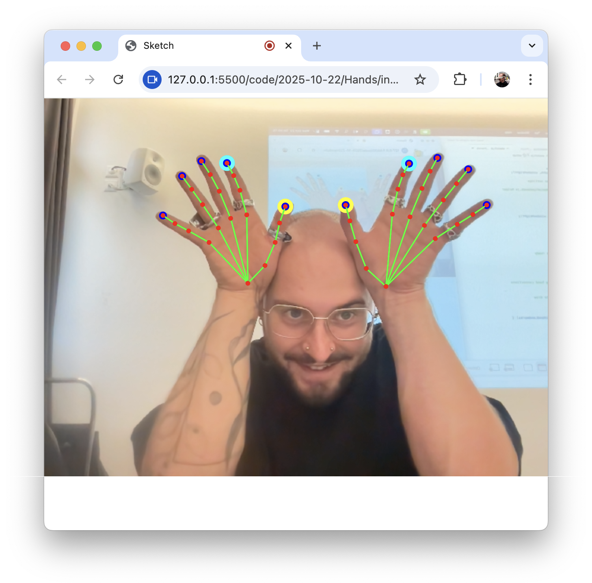

# MediaPipe Hands + P5.js Demo
This folder contains a demo of the Google MediaPipe Hands Landmark Detection API integrated with P5.js.

You can download this as a folder here: [MediaPipe Hands + P5.js Demo](https://github.com/abstractmachine/head-md-oracle-of-suits/releases/latest)

### Release
You can download this `Hands` demo as a complete folder here:
- [MediaPipe Hands + P5.js Demo](https://github.com/abstractmachine/head-md-oracle-of-suits/releases/latest)

### Quick & Dirty method
Download the [Hands demo release](https://github.com/abstractmachine/head-md-oracle-of-suits/releases/latest) as a downloadable folder, rename this folder to whatever name you want, and place it in your daily folder.

## Create P5.js method
- As before, use the standard `View` → `Command Palette` → `Create P5.js Project` method
- Copy/paste [the code from the hands demo index.html](./index.html) your new `index.html`
- Create a new file named `MediaPipeHands.js` and copy/paste [the code from the hands demo](./MediaPipeHands.js) into this new file
- Start working with your new `sketch.js`