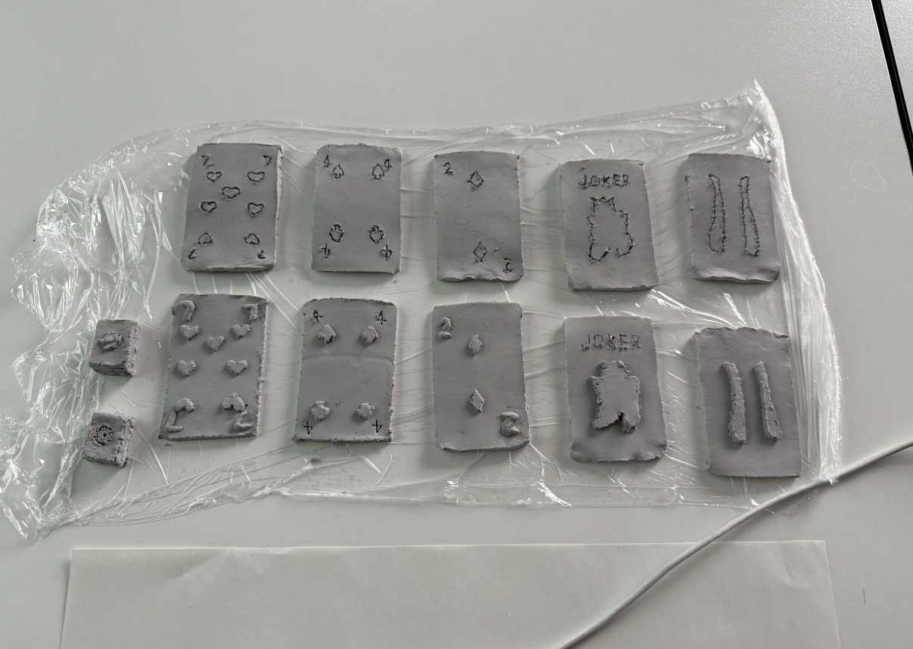
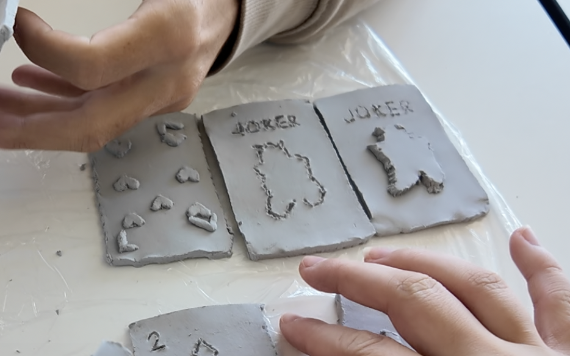
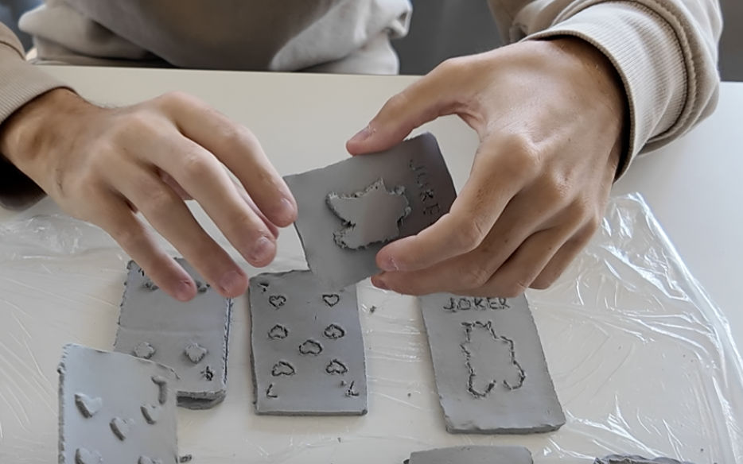
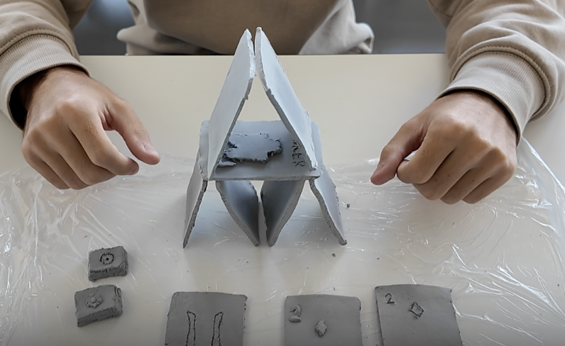
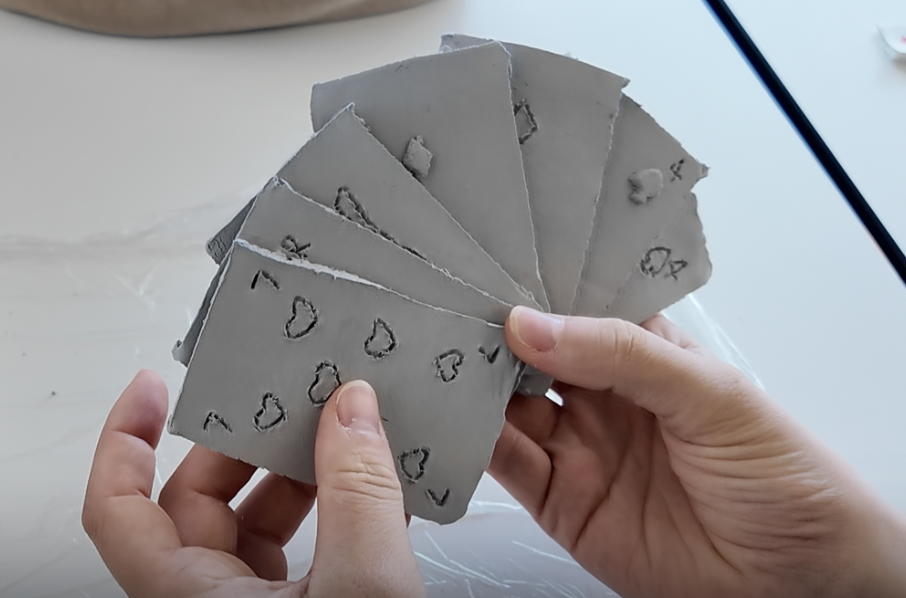

# Zhanlan Wang

## Research

The touching feeling of the physical board card game in a non-paper / 3D form.

### The 1st Prototype

- Initial idea
    - The experienced Majong player they dont need to see the cards, they can know just by touching, then play quickly.
- 2 versions:
    - 凹 Concave
    - 凸 Convex
- 3 different board card games: 
    - Poker x 4: 7️⃣❤️, 4️⃣♠️，2️⃣♦️，Joker
    - Italian Card: 2️⃣
    - Majong：🀄️1️⃣

### Feedback from different Audience

same insights in sentence, 
Image to the idea
short consice
#### 1.Physical touching feeling
3D, No word,Corner is too sharp(Corner-Unprocessed), Something on the surface, dangerous, number are unstable, Because use the same material, didnt feel lots of difference; Weird card, harsh, afraid to break it(because she will play the card in a very violent way), Prefer 凹 because even close eyes can feel, For 凸 when touch, confuse about the gap/space of the number and suits(❤️), The revert ❤️ touched like diamond 💎; Generally too rough to play with; feel better when touch the bigger symbol than the small, cannot count the number when touch the small(7❤️)
#### 2.Compare 凹凸
- 凸 are more ceramic than the 凹 (maybe because of the weight)
- 凹 sharp 凸 more visual， can trace
- 凸 is more fragile than 凹
- prefer 凸, more convenient to touch
- 感觉凸起来的很爽（看起来像盲文Braille），但摸起来凹下去的很爽
- 凹 smooth 凸 rough
- Prefer 凸 than 凹
#### 3.symbol of suits or number
- Numbers are unstable
- Put symbol and number separated
- Without the number can still know the information from the symbol itself
- The revert ❤️ touched like diamond 💎
- 掉了 Number Drop
- Majong 👉 dice 🎲
#### 4.Function/Way of play
- Take the sculpted cards' figures out, it will be fun to match
- Freestyle: Create a rule for themself and play
- Match the card(put the 凸 embedded in 凹)

- Card Tower / Card Pyramid

- Play like normal paper card

- Separate the number/suits with cards, customize the card

Conclusion:
My research started from the physical touching of the non-paper/3D cards, then I create the ceramic cards as my 1st prototype, when I observed how audience play this cards without giving them the specific rules, I found the very interesting ways they play which were I didnt expect.
Then I develop my idea to try different material, size, 

## Work title

Make a customized system for the audience to play the suits/number/elements of borad card games(which specific game, not decision)

## Keyword

1. Structure: 凹，凸 (Concave and Convex)
2. Material
3. Size
4. Shape
5. texture

## User Journey

|         | stage1            | stage2                                         | stage3                                                    | stage4   |
| ------- | ----------------- | ---------------------------------------------- | --------------------------------------------------------- | -------- |
| action  | Look at the cards | Watch/Figure out their own way to start        | Play with different elements, touch the texture, material | Feedback |
| emotion | Confused, curious | Find their own way to have fun/Maybe get bored | (need more research)                                      |          |

## Novel Combinations
1. Physical Touch
2. Customize 
3. Non-paper card

